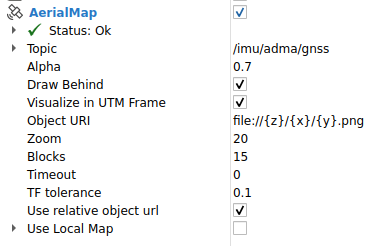
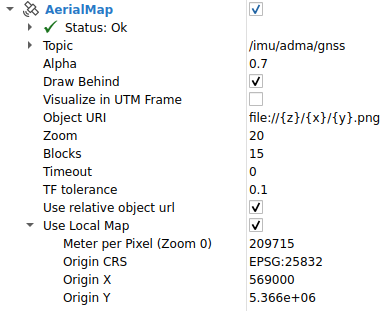

# rviz_satellite

Rviz plugin for displaying satellite maps at the position of a `sensor_msgs/msg/NavSatFix` message.

> **_NOTE:_**  Looking for the ROS1 version? Checkout the ros1 branch!

## Usage

Add an instance of `AerialMap` to your Rviz config and point it to a `sensor_msgs/msg/NavSatFix` topic.

Map tiles will be cached to `$HOME/.cache/rviz_satellite`.
At present the cache does not expire automatically - you should delete the files in the folder if you want the images to be reloaded.

Currently, the [OpenStreetMap](http://wiki.openstreetmap.org/wiki/Slippy_map_tilenames) convention for tile URLs is supported.
This e.g. implies that only raster tiles (no vector tiles) are supported.

To try a demo, run the following commands to make Rviz circle around a geo point you define.

```bash
ros2 launch rviz_satellite demo.launch.xml
```

You should see a view like the following.
Here, the coordinates are 48.211486, 16.383982 (Vienna), using OpenStreetMap tiles.


## Tile servers

You must provide a tile URL (Object URI) from which the satellite images are loaded.
The URL should have the form `http://server.tld/{z}/{x}/{y}.jpg`.
Where the tokens `{z}`, `{x}`, `{y}` represent the zoom level, x coordinate, and y coordinate respectively.
These will automatically be substituted by rviz_satellite when making HTTP requests.

Tiles can optionally be loaded from a local filesystem if downloaded beforehand
for cases where robots do not have internet access. For example, the file URI
`file:///tmp/tile/{z}/{y}/{x}.jpg` can be used to load files from the `/tmp/tile` directory.

rviz_satellite doesn't come with any preconfigured tile URL.
For example, you could use one of the following tile servers:

* OpenGeoData BW (upto Zoom 20): https://owsproxy.lgl-bw.de/owsproxy/ows/WMTS_LGL-BW_ATKIS_DOP_20_C?SERVICE=WMTS&REQUEST=GetTile&VERSION=1.0.0&LAYER=DOP_20_C&STYLE=default&TILEMATRIXSET=GoogleMapsCompatible&TILEMATRIX=GoogleMapsCompatible:{z}&TILEROW={y}&TILECOL={x}&FORMAT=image/png  (GoogleMapsCompatible = WebMercator)
* OpenGeoData BW (only upto Zoom 15, but UTM): https://owsproxy.lgl-bw.de/owsproxy/ows/WMTS_LGL-BW_ATKIS_DOP_20_C?SERVICE=WMTS&REQUEST=GetTile&VERSION=1.0.0&LAYER=DOP_20_C&STYLE=default&TILEMATRIXSET=ADV_25832_Quad&TILEMATRIX=ADV_25832_Quad:{z}&TILEROW={y}&TILECOL={x}&FORMAT=image/png
  * Use Local Map: true
  * Meter per Pixel: 4891.97    
  * Origin CRS: EPSG:25832    
  * Origin X: -46133.17    
  * Origin Y: 6301219.54
* OpenStreetMap: https://tile.openstreetmap.org/{z}/{x}/{y}.png (only Zoom of 15 or 16)
* TomTom: https://api.tomtom.com/map/1/tile/basic/main/{z}/{x}/{y}.png?tileSize=512&key=[TOKEN]  (Token required) 
* Mapbox: https://api.mapbox.com/styles/v1/mapbox/satellite-v9/tiles/256/{z}/{x}/{y}?access_token=[TOKEN]  (Token required)

For some of these, you have to request an access token first.
Please refer to the respective terms of service and copyrights.

## Options

- `Topic` is the topic of the GPS measurements.
- `Alpha` is simply the display transparency.
- `Draw Behind` will cause the map to be displayed below all other geometry.
- `Zoom` is the zoom level of the map. Recommended values are 16-19, as anything smaller is _very_ low resolution. 22 is the current max.
- `Blocks` number of adjacent tiles in addition to the center tile to load, 8 maximum.
- `Timeout` specifies a timeout since the last received message timestamp, after which the map will be faded out; disable by setting to 0.

## Local Tiles

If you want to load your own local tiles from map data  you should 
copy the tiles into the `rviz_satellite/tiles/20/` folder (`20` is the required zoom `{z}`) and enter an object URL of 
`file://{z}/{x}/{y}.png`. When `use local tiles` is checked, the object url must be relative. If you want to visualize in
an UTM frame the property `Visualize in UTM Frame` should be checked too.

### Slicing your own tiles out of tiff data into Web Mercator tiles

1. Download .tiff data from e.g.  https://opengeodata.lgl-bw.de/#/(sidenav:product/dop20)
2. Copy all relevant .tiff files into one directory (e.g. `input_dir`)
3. Make sure you have installed the `gdal` library

```commandline
sudo apt update   
sudo apt install -y gdal-bin libgdal-dev
```
4. Run the Python script `slice_tiles.py`, e.g.:
```commandline
python3 ~/workspace/aduulm_sandbox/src/rviz_plugins/rviz_satellite/slice_tiles.py --input_dir ~/Downloads/Tiffs/ --output_dir ~/workspace/aduulm_sandbox/src/rviz_plugins/rviz_satellite/tiles
```

5. Make sure that the structure of the folder `tiles` is
```commandline
tiles/
└── 20/
    ├── 553311/
    │   ├── 362607.png
    │   ├── 362608.png
    │   └── ... 
    ├── 553312/
    │   ├── 362607.png
    │   ├── 362608.png
    │   └── ...
    ├── .../
```

### Plugin options for local tiles that are NOT in UTM (but you want them to be; otherwise disable `Visualize in UTM Frame`):



## Local Maps

If you want to use a tile server which only supports a specific region instead of the whole world or if you have local tiles from another CRS than WebMercator you can enable the `Use Local Map` option. This also means that the zoom levels and tile coverage (see [here](https://wiki.openstreetmap.org/wiki/Slippy_map_tilenames#Zoom_levels)) deviate and need to be defined manually. In particular, the `local origin` is the top-left corner of the local map region.

The options can be set after unfolding the top-level `Use Local Map` option:

- `Meter per Pixel (Zoom 0)` defines the length of a pixel edge in the image in meter at zoom level 0. Default is 0.0.
- `Origin CRS` is the [epsg code](https://epsg.io/) of the coordinate reference system (CRS) of the local origin (should be a cartesian coordinate system). Default is not set.
- `Origin X` is the X position of the local origin in given CRS system. Default is 0.0.
- `Origin Y` is the Y position of the local origin in given CRS system. Default is 0.0.

### Example Usage (1)

The tiff files downloaded from e.g. https://opengeodata.lgl-bw.de/#/(sidenav:product/dop20) are in UTM coordinates (EPSG:25832). So if you also want to visualize in UTM coordinates you
simple can slice your own tiles as described above but with setting the `--utm_tiles` flag:

1. Download .tiff data from e.g.  https://opengeodata.lgl-bw.de/#/(sidenav:product/dop20)
2. Copy all relevant .tiff files into one directory (e.g. `input_dir`)
3. Make sure you have installed the `gdal` library

```commandline
sudo apt update   
sudo apt install -y gdal-bin libgdal-dev
```
4. Run the Python script `slice_tiles.py`, e.g.:
```commandline
python3 ~/workspace/aduulm_sandbox/src/rviz_plugins/rviz_satellite/slice_tiles.py --utm_tiles --input_dir ~/Downloads/Tiffs/ --output_dir ~/workspace/aduulm_sandbox/src/rviz_plugins/rviz_satellite/tiles
```

5. Make sure that the structure of the folder `tiles` is
```commandline
tiles/
└── 20/
    ├── 0/
    │   ├── 0.png
    │   ├── 1.png
    │   └── ... 
    ├── 1/
    │   ├── 0.png
    │   ├── 1.png
    │   └── ...
    ├── .../
    ├── utm_origin_info.txt
```

### Plugin options for local map:


The parameters for the `Use Local Map` property is automatically saved into `utm_origin_info.txt` (inside of the `20` folder):
```text
Meter per pixel Zoom 0: 209715.2
Origin CRS: 25832
Origin X: 569000.000001
Origin Y: 5366000.000000999
```

### Example Usage (2)

Public orthographic photos are povided by [Geobasis NRW](https://www.bezreg-koeln.nrw.de/geobasis-nrw/webdienste/geodatendienste) and publicly available using the scheme described [here](https://www.wmts.nrw.de/geobasis/wmts_nw_dop/tiles/nw_dop/EPSG_25832_16/1.0.0/WMTSCapabilities.xml). The tiles only cover a smaller part of western Germany but have a very high resolution. The following options can be used and directly derived from the scheme.

- `Object URI: https://www.wmts.nrw.de/geobasis/wmts_nw_dop/tiles/nw_dop/EPSG_25832_16/{z}/{x}/{y}`
- `Meter per Pixel (Zoom 0): 4891.97` 
- `Origin CRS: EPSG:25832` 
- `Origin X: -46133.17`
- `Origin Y: 6301219.54`

## Support and Contributions

In case of questions or problems, do not hesitate to open an issue.

Contributions are welcomed. Please add a summary of your changes to the [changelog](CHANGELOG.rst) under the section Forthcoming.

## Icon copyright

The icon was downloaded and edited from [svgrepo](https://www.svgrepo.com/svg/118507/satellite), originally licensed under CC0.
